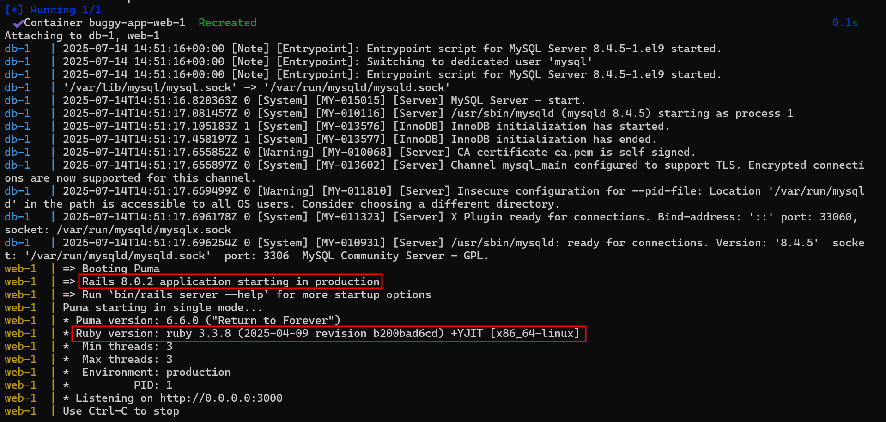

# Docker Rails Production Setup

This document outlines the complete Docker setup for a Ruby on Rails application with MySQL database and Nginx reverse proxy in production environment.

## 1. Base Docker Image (Dockerfile.base)

Created a base Docker image with Ruby 3.3.8 and MySQL database dependencies. The base image includes:

- Ruby 3.3.8
- System dependencies for MySQL connectivity
- Timezone configuration
```Dockerfile
FROM ruby:3.3.8

ENV DEBIAN_FRONTEND=noninteractive
ENV TZ=Asia/Kolkata

# Install system packages and MySQL dependencies
RUN apt-get update -qq && apt-get install -y \
    nodejs \
    default-mysql-client \
    default-libmysqlclient-dev \
    build-essential \
    tzdata \
    && rm -rf /var/lib/apt/lists/*

WORKDIR /app

```
- Run this command `docker build -f Dockerfile.base -t ruby-base:3.3.8 . `

## 2. Application Docker Image (Dockerfile.app)

Built the Rails application Docker image on top of the base image with:

- Gemfile copying and bundle installation for production
- Application code copying
- Asset precompilation
- Rails server startup command

```Dockerfile
FROM ruby-base:3.3.8

WORKDIR /app

COPY Gemfile Gemfile.lock ./
RUN gem install bundler && bundle install --without development test

COPY . .

# Precompile assets for production
RUN RAILS_ENV=production bundle exec rails assets:precompile

EXPOSE 3000

CMD ["bash", "-c", "bundle exec rails db:migrate && rails server -b 0.0.0.0"]

```
- Run this command `docker build -f Dockerfile.app -t my-rails-app . `

## 3. Docker Compose Configuration (docker-compose.yml)

Created a docker-compose.yml file that three services:
```yaml
version: '3.8'

services:
  db:
    image: mysql:8
    restart: always
    env_file:
      - .env.db.production
    ports:
      - "3306:3306"
    volumes:
      - db_data:/var/lib/mysql
    healthcheck:
      test: ["CMD", "mysqladmin", "ping", "-h", "localhost"]
      interval: 10s
      timeout: 5s
      retries: 5

  web:
    image: my-rails-app 
    ports:
      - "3000:3000"
    depends_on:
      - db
    env_file:
      - .env.web.production
    healthcheck:
      test: ["CMD", "curl", "-f", "http://127.0.0.1:3000"]
      interval: 10s
      timeout: 5s
      retries: 5
  
  nginx:
    image: nginx:latest
    ports:
      - "80:80"
    depends_on:
      - web
    volumes:
      - ./nginx.conf:/etc/nginx/conf.d/default.conf:ro
    restart: always
    healthcheck:
      test: ["CMD", "curl", "-f", "http://localhost"]
      interval: 10s
      timeout: 5s
      retries: 3


volumes:
  db_data:

```

### Services Configured:
- **db service**: MySQL 8.0 database with environment file linking 
- **web service**: Rails application built from Dockerfile.app
- **nginx service**: Nginx reverse proxy with configuration volume mount

## 4. Environment Files

### .env.web.production
Created environment file for the web application containing:
- Rails production configuration
- Database connection settings
```env
# Rails App (web service)
RAILS_ENV=
DB_HOST=
DB_NAME=
DB_USER=
DB_PASSWORD=
SECRET_KEY_BASE=
```

### .env.db.production
Created environment file for MySQL database with:
- MySQL root password
- Database name and user credentials
```env
MYSQL_ROOT_PASSWORD=
MYSQL_DATABASE=
MYSQL_USER=
MYSQL_PASSWORD=
```

## 5. Nginx Configuration

Added Nginx Docker container as reverse proxy 

```conf
server {
    listen 80;

    server_name localhost;

    location / {
        proxy_pass http://web:3000;
        proxy_set_header Host $host;
        proxy_set_header X-Real-IP $remote_addr;
        proxy_set_header X-Forwarded-For $proxy_add_x_forwarded_for;
        proxy_set_header X-Forwarded-Proto $scheme;
    }
}

```

## 6. Health Checks Implementation

Added comprehensive health checks for all three containers:

### Database Health Check:
- MySQL ping command verification `["CMD", "mysqladmin", "ping", "-h", "localhost"]`
- 10-second intervals with 5 retries

### Web Application Health Check:
- HTTP curl request to  endpoint `http://127.0.0.1:3000`
- 10-second intervals with 5 retries

### Nginx Health Check:
- HTTP request through proxy to health endpoint `http://localhost`
- 10-second intervals with 5 retries

## 7. Makefile Commands

Created a Makefile with four main commands 
- **build**: Builds both base and application Docker images
- **up**: Starts all services using docker-compose
- **down**: Stops all services and removes containers
- **logs**: Views real-time logs from all services


## 8. Implementation Summary

The complete setup includes:

1. **Two Docker files** - base image for Ruby 3.3.8 with MySQL, and application image
2. **Docker-compose.yml** -  web (Rails), database (MySQL), and nginx services
3. **Environment files** - separate production configurations for web and database
4. **Health checks** - monitoring for all three container services
5. **Makefile** - simplified commands for build, run, and management operations
6. **Nginx reverse proxy** - serving the Rails application with proper configuration
7. **Production environment** - all services configured for RAILS_ENV=production

## 9. Output 

